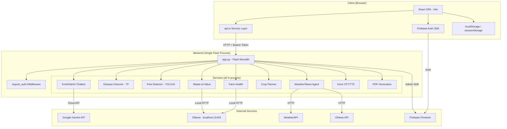

# KrishiSahAI — Actual System Architecture Analysis

## What You Actually Have vs. What the Techfiesta Report Describes

Your Techfiesta report describes an **idealized, production-scale distributed system**. Your actual codebase is a **well-structured monolith** that is functional and practical for its current stage but architecturally simpler. Below is a layer-by-layer comparison.

---

## 1. Overall Architecture Pattern

| Aspect | Techfiesta Report | Actual Codebase |
|---|---|---|
| **Pattern** | Distributed microservices with separate workers | **Single Flask monolith** ([app.py](file:///c:/MY/MYPROJECTS/impetus/Backend/app.py)) |
| **Backend** | Multiple independent services behind a gateway | One [app.py](file:///c:/MY/MYPROJECTS/impetus/Backend/app.py) (1111 lines) that imports and wires all 10 service modules |
| **Frontend** | Client as thin data capture layer | **Vite + React + TypeScript SPA** with significant client-side logic |

Your backend is a **single-process Flask application** that runs all services — chatbot, disease detection, pest detection, waste analysis, farm health, weather, news, voice, PDF generation, and crop planning — in the same Python process.

---

## 2. API Gateway — ❌ Not Currently Used

> [!IMPORTANT]
> **You do NOT have an API gateway.** The Techfiesta report describes a dedicated API Gateway layer for security, rate limiting, and request routing. Your actual setup is:

| Techfiesta Report | Actual Implementation |
|---|---|
| Dedicated API Gateway (e.g., Kong, AWS API Gateway) | **No gateway** — Flask app directly serves all routes |
| Token validation at gateway level | **`@require_auth` decorator** on individual routes in [auth.py](file:///c:/MY/MYPROJECTS/impetus/Backend/middleware/auth.py) |
| Rate limiting enforced at gateway | **No rate limiting** (mentioned in [DETAIL.md](file:///c:/MY/MYPROJECTS/impetus/DETAIL.md) as "not yet implemented") |
| Request classification & routing | **All routes served by same Flask process** |

### What you have instead:
- **Flask-CORS middleware** handles cross-origin requests
- **`@require_auth` decorator** verifies Firebase ID tokens per-route
- **Development bypass**: When `DISABLE_AUTH=true`, auth is skipped entirely
- **ngrok** (based on headers like `ngrok-skip-browser-warning`) for external tunneling during dev

---

## 3. Authentication & Security

| Component | Implementation |
|---|---|
| **Auth Provider** | **Firebase Authentication** (client-side in [firebase.ts](file:///c:/MY/MYPROJECTS/impetus/Frontend/firebase.ts)) |
| **Token Type** | Firebase ID Tokens (JWT) |
| **Backend Validation** | `firebase_admin.auth.verify_id_token()` in [auth.py](file:///c:/MY/MYPROJECTS/impetus/Backend/middleware/auth.py) |
| **Security Headers** | **Talisman is disabled** (commented out in [app.py](file:///c:/MY/MYPROJECTS/impetus/Backend/app.py) line 77) |
| **HTTPS** | Not enforced (dev mode), relies on ngrok for HTTPS in tunneled access |

---

## 4. Request Processing — All Synchronous, No Async Pipeline

> [!WARNING]
> The Techfiesta report describes a bifurcated sync/async execution path with message queues and inference workers. **Your system processes everything synchronously.**

| Techfiesta Report | Actual Implementation |
|---|---|
| Sync path for chat, async path for inference | **All requests are synchronous** in the same Flask process |
| Message queue (e.g., RabbitMQ, SQS) | **No message queue** |
| Separate GPU inference workers | **TensorFlow and YOLOv5 models loaded in-process** (lazy-loaded on first use) |
| Job IDs with notifications | **Direct request-response** — user waits for result |

### How requests actually flow:
```
Browser → HTTP Request → Flask app.py → @require_auth → Service function → Response
```

There is **one exception** to pure request-response: **SSE (Server-Sent Events) streaming** is used for chatbot and waste-to-value chat responses, which streams LLM output incrementally back to the client.

---

## 5. AI Inference Layer

| Service | Model/Engine | How It Runs |
|---|---|---|
| **Chatbot (KrishiSahAI)** | Google Gemini API (via [krishi_chatbot.py](file:///c:/MY/MYPROJECTS/impetus/Backend/services/BusinessAdvisor/krishi_chatbot.py)) | Cloud API call, streamed via SSE |
| **Disease Detection** | TensorFlow `.h5` model ([disease_detector.py](file:///c:/MY/MYPROJECTS/impetus/Backend/services/DiseaseDetector/disease_detector.py)) | **Loaded in-process**, lazy-initialized |
| **Pest Detection** | YOLOv5 custom model ([pest_detector.py](file:///c:/MY/MYPROJECTS/impetus/Backend/services/PestDetector/pest_detector.py)) | **Loaded in-process**, lazy-initialized |
| **Waste-to-Value** | Ollama (local LLM, `llama3.2`) | Local HTTP call to `localhost:11434` |
| **Farm Health** | Ollama (local LLM) | Local HTTP call to Ollama |
| **Crop Planner** | LLM-based generation | Via planner service |
| **Voice (STT/TTS)** | Coqui TTS / speech recognition | Local processing |

The Techfiesta report describes a "hybrid AI inference strategy" with edge, local, and cloud tiers. In practice:
- **Cloud**: Gemini API for chatbot
- **Local server**: Ollama for waste/health analysis, TensorFlow/YOLOv5 for image inference
- **Edge/client**: No client-side inference

---

## 6. Caching Strategy

| Techfiesta Report | Actual Implementation |
|---|---|
| Dedicated cache layer (Redis/Memcached) | **No server-side cache** |
| Cache-first lookup for all requests | **Client-side `localStorage` and `sessionStorage` only** |

### What's actually cached:

| Data | Storage | Location in Code |
|---|---|---|
| Crop cycle roadmap | `localStorage` (key: `crop_plan_{uid}_{crop}_{lang}`) | [Home.tsx](file:///c:/MY/MYPROJECTS/impetus/Frontend/pages/Home.tsx) |
| Weather data per chat session | In-memory Python variable | [krishi_chatbot.py](file:///c:/MY/MYPROJECTS/impetus/Backend/services/BusinessAdvisor/krishi_chatbot.py) |
| Advisor sessions | In-memory Python dict (`advisor_sessions`) | [app.py](file:///c:/MY/MYPROJECTS/impetus/Backend/app.py) |
| TF/YOLO models | In-memory (lazy-loaded once) | [app.py](file:///c:/MY/MYPROJECTS/impetus/Backend/app.py) globals |
| Waste analysis (Streamlit UI) | `@st.cache_data(ttl=3600)` | [ui.py](file:///c:/MY/MYPROJECTS/impetus/Backend/services/WasteToValue/src/ui.py) |
| Theme, language, farm data | `localStorage` | Various frontend contexts |
| Detection history | `localStorage` | [DetectionHistorySidebar.tsx](file:///c:/MY/MYPROJECTS/impetus/Frontend/components/DetectionHistorySidebar.tsx) |
| Farm health results | `sessionStorage` | [FarmHealth.tsx](file:///c:/MY/MYPROJECTS/impetus/Frontend/pages/FarmHealth.tsx) |

---

## 7. Data Storage

| Techfiesta Report | Actual Implementation |
|---|---|
| Dual-layer cache + persistent DB | **Firebase Firestore only** (no cache layer) |
| Disk-based persistent store | **Firestore (cloud NoSQL)** for all persistent data |

### Firestore collections used:
- `users/{uid}` — user profiles
- `users/{uid}/crop_plans/{planId}` — saved crop cycle roadmaps
- `users/{uid}/chats/{chatId}` — chat sessions
- `users/{uid}/chats/{chatId}/messages` — chat messages

---

## 8. CDN & Edge Layer — ❌ Not Currently Used

| Techfiesta Report | Actual Implementation |
|---|---|
| CDN for static assets and TLS termination | **Vite dev server** serves frontend locally |
| Edge nodes for latency reduction | **No CDN** — direct connection to `localhost:5000` |
| Geographic distribution | **Single machine** only |

In production (if deployed), the Vite `dist/` build could be hosted on Firebase Hosting or Vercel, which provides CDN capabilities. But currently, everything runs on one local machine.

---

## 9. Scaling Characteristics

| Techfiesta Report | Actual Implementation |
|---|---|
| Horizontal scaling with stateless instances | **Cannot scale horizontally** — `advisor_sessions` dict is in-memory |
| Dynamic worker scaling based on queue | **No workers or queues** |
| Load balancer compatible | **Single instance only** |

> [!NOTE]
> The `advisor_sessions` in-memory dict is the main blocker for horizontal scaling. As noted in your [DETAIL.md](file:///c:/MY/MYPROJECTS/impetus/DETAIL.md), migrating this to Redis would be required before multi-instance deployment.

---

## 10. Actual Architecture Diagram



---

## Summary: Report vs. Reality

| Layer | Techfiesta Report | Your Codebase | Gap |
|---|---|---|---|
| API Gateway | ✅ Dedicated gateway | ❌ Flask routes + decorator | **Major** |
| Rate Limiting | ✅ At gateway level | ❌ Not implemented | **Major** |
| CDN / Edge | ✅ Content delivery network | ❌ Local dev server | **Major** (would exist in prod deploy) |
| Message Queue | ✅ Async job processing | ❌ All synchronous | **Major** |
| Inference Workers | ✅ Separate GPU containers | ❌ In-process models | **Major** |
| Cache Layer | ✅ Redis/Memcached | ❌ localStorage only | **Major** |
| Auth | ✅ Token validation | ✅ Firebase Auth + decorator | **Match** |
| SSE Streaming | ✅ Real-time responses | ✅ SSE for chat | **Match** |
| LLM Integration | ✅ Model calls | ✅ Gemini + Ollama | **Match** |
| Persistent Storage | ✅ Database | ✅ Firestore | **Match** |
| Monitoring | ✅ Metrics and observability | ❌ Console logging only | **Major** |

> [!CAUTION]
> The Techfiesta report describes what the architecture **would look like at scale**. Your current codebase is a **working prototype/MVP** with a monolithic backend. The report is aspirational — it represents the target architecture, not the current state.
